## Hey, I'm Ray 

Math major at NCU, Taiwan. I build compilers, VS Code extensions, and graphics engines on the side.
Currently into competitive programming and systems-level C/C++.

### Featured Projects

| Project | Description |
| --- | --- |
| [**asymptote**](https://github.com/rayhuang2006/asymptote) | VS Code extension for competitive programmers. Real-time time complexity analysis + Codeforces test runner. `TypeScript` |
| [**RayCompiler**](https://github.com/rayhuang2006/RayCompiler) | A JIT compiler built on LLVM. Lexer → parser → codegen, the full pipeline. `C++` `LLVM` |
| [**CPyGfx**](https://github.com/rayhuang2006/CPyGfx) | Mini graphics engine written in C, with Python bindings via ctypes. `C` `SDL2` |
| [**WBC_Website**](https://github.com/rayhuang2006/WBC_Website) | Interactive data viz dashboard for the World Baseball Classic. 3D globe + radar charts. `Flask` `Plotly.js` |

### Competitive Programming

   112 problems solved

### Tech Stack

  
  
  
  
  
  
  
  
  
  
  
  
  
  
  

### Stats

  
  

